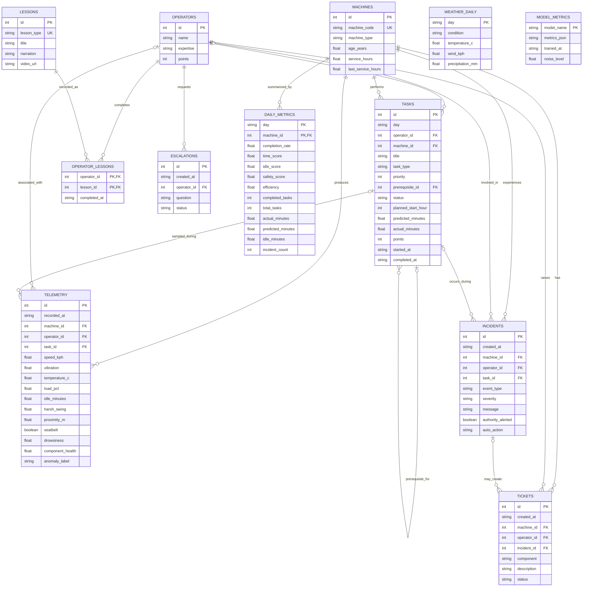

# Entity-Relationship Diagram

The operational store is SQLite with foreign-key enforcement enabled. `WEATHER_DAILY`, `MODEL_METRICS`, and the date portion of `DAILY_METRICS` are intentionally independent records; matching dates are joined by application logic rather than declared foreign keys.

## Relationship notes

- A task belongs to one operator and one machine and may reference one prerequisite task.
- Telemetry always belongs to a machine; operator and task links are nullable for samples outside a task context.
- Incidents always belong to a machine and may be linked to an operator and task.
- A ticket always belongs to a machine and operator and may originate from an incident.
- `OPERATOR_LESSONS` resolves the many-to-many relationship between operators and lessons and records completion time.
- Daily metrics use the composite key `(day, machine_id)` and measure the machine, not the operator.
- Chroma documents and Joblib model files are artifact stores, not relational entities, so they are shown in the system architecture rather than this ER model.

