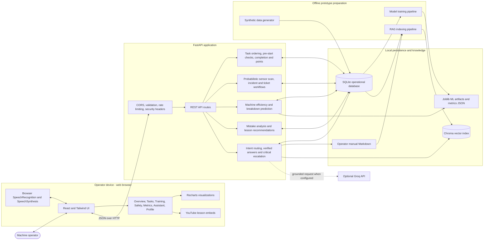

# System Architecture

This diagram describes the implemented hackathon prototype. Sensor readings, supervisor contact, weather changes, and machine conditions are simulated; they are not connected to production machinery or notification systems.

## Runtime responsibilities

| Layer | Implemented responsibility |
| --- | --- |
| Browser | Navigation, dark theme, task controls, hazard popups, charts, training videos, typed chat, wake phrase detection, speech input, and voice playback. |
| FastAPI | Validates requests, enforces task state rules, provides dashboards, simulates sensor scans, records safety actions, calculates metrics, and serves assistant answers. |
| Assistant service | Handles greetings, live task questions, navigation, motivation, verified manual answers, strict unknown responses, hybrid retrieval, and optional grounded Groq generation. |
| SQLite | Stores operators, machines, tasks, telemetry, incidents, tickets, lessons, completions, escalations, weather, and calculated/model metrics. |
| ML artifacts | Provide task-duration regression, breakdown classification and hours-to-failure projection, and anomaly detection. |
| Chroma and manual | Supply local retrieval context. Safety thresholds and known operating procedures are answered through verified manual routes before optional generation. |

## Prototype trust boundaries

- Browser microphone access is optional and remains controlled by the browser.
- The API is the authority for points, task transitions, incidents, tickets, lesson completion, and metrics.
- A critical voice report creates local incident, ticket, and escalation records. It does not contact a real supervisor.
- Synthetic sensor scans imitate unexpected telemetry-driven hazards; no physical-machine sensor stream is connected.
- Groq is optional. Unknown, irrelevant, or inappropriate questions return the fixed supervisor fallback instead of unrelated retrieved text.

