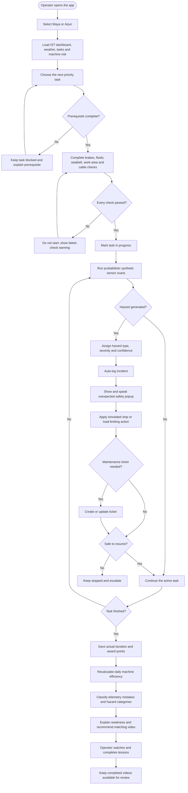
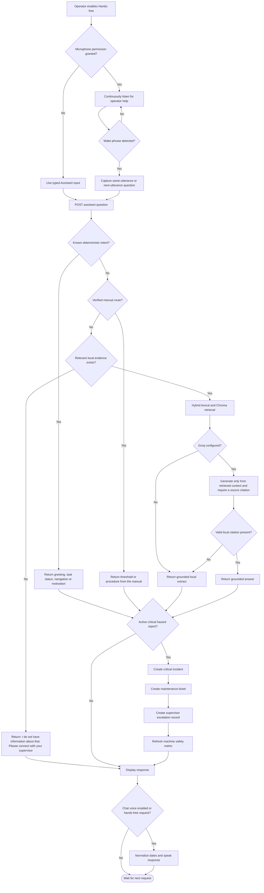
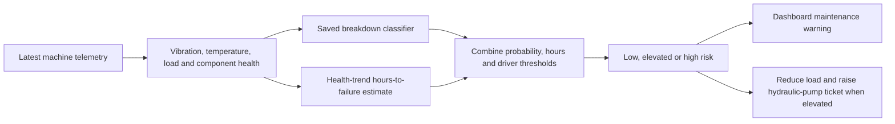

# Application Workflows

## Shift, task, hazard, and training workflow

```mermaid
flowchart TD
    start([Operator opens the app]) --> select[Select Maya or Arjun]
    select --> dashboard[Load IST dashboard, weather, tasks and machine risk]
    dashboard --> choose[Choose the next priority task]
    choose --> prereq{Prerequisite complete?}
    prereq -- No --> blocked[Keep task blocked and explain prerequisite]
    blocked --> choose
    prereq -- Yes --> checks[Complete brakes, fluids, seatbelt, work-area and cable checks]
    checks --> allpass{Every check passed?}
    allpass -- No --> stop[Do not start; show failed-check warning]
    stop --> checks
    allpass -- Yes --> active[Mark task in progress]

    active --> monitor[Run probabilistic synthetic sensor scans]
    monitor --> hazard{Hazard generated?}
    hazard -- No --> work[Continue the active task]
    work --> finished{Task finished?}
    finished -- No --> monitor

    hazard -- Yes --> classify[Assign hazard type, severity and confidence]
    classify --> autolog[Auto-log incident]
    autolog --> popup[Show and speak unexpected safety popup]
    popup --> action[Apply simulated stop or load-limiting action]
    action --> manualticket{Maintenance ticket needed?}
    manualticket -- Yes --> ticket[Create or update ticket]
    manualticket -- No --> resume{Safe to resume?}
    ticket --> resume
    resume -- No --> supervisor[Keep stopped and escalate]
    resume -- Yes --> work

    finished -- Yes --> complete[Save actual duration and award points]
    complete --> metric[Recalculate daily machine efficiency]
    metric --> mistakes[Classify telemetry mistakes and hazard categories]
    mistakes --> recommend[Explain weakness and recommend matching video]
    recommend --> lesson[Operator watches and completes lessons]
    lesson --> library[Keep completed videos available for review]
```

## Hands-free assistant workflow

```mermaid
flowchart TD
    enable[Operator enables Hands-free] --> permission{Microphone permission granted?}
    permission -- No --> typed[Use typed Assistant input]
    permission -- Yes --> wake[Continuously listen for operator help]
    wake --> heard{Wake phrase detected?}
    heard -- No --> wake
    heard -- Yes --> capture[Capture same-utterance or next-utterance question]
    typed --> ask[POST assistant question]
    capture --> ask

    ask --> intent{Known deterministic intent?}
    intent -- Yes --> direct[Return greeting, task status, navigation or motivation]
    intent -- No --> manual{Verified manual route?}
    manual -- Yes --> verified[Return threshold or procedure from the manual]
    manual -- No --> supported{Relevant local evidence exists?}
    supported -- No --> unknown[Return: I do not have information about that. Please connect with your supervisor]
    supported -- Yes --> retrieve[Hybrid lexical and Chroma retrieval]
    retrieve --> groq{Groq configured?}
    groq -- No --> grounded[Return grounded local extract]
    groq -- Yes --> generate[Generate only from retrieved context and require a source citation]
    generate --> cited{Valid local citation present?}
    cited -- No --> grounded
    cited -- Yes --> answer[Return grounded answer]

    direct --> critical{Active critical hazard report?}
    verified --> critical
    grounded --> critical
    answer --> critical
    unknown --> present[Display response]
    critical -- No --> present
    critical -- Yes --> incident[Create critical incident]
    incident --> ticket[Create maintenance ticket]
    ticket --> escalate[Create supervisor escalation record]
    escalate --> refresh[Refresh machine safety metric]
    refresh --> present
    present --> voice{Chat voice enabled or hands-free request?}
    voice -- Yes --> speak[Normalize dates and speak response]
    voice -- No --> done([Wait for next request])
    speak --> done
```

## Breakdown prediction workflow

```mermaid
flowchart LR
    telemetry[Latest machine telemetry] --> features[Vibration, temperature, load and component health]
    features --> classifier[Saved breakdown classifier]
    features --> health[Health-trend hours-to-failure estimate]
    classifier --> combine[Combine probability, hours and driver thresholds]
    health --> combine
    combine --> risk[Low, elevated or high risk]
    risk --> dashboard[Dashboard maintenance warning]
    risk --> guidance[Reduce load and raise hydraulic-pump ticket when elevated]
```

